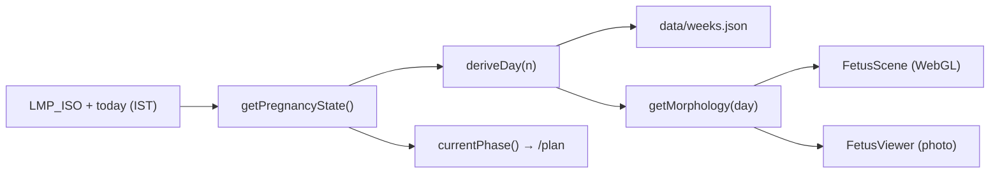

# Baby Journey AI — Project Reference (`project.md`)

> A premium, **static** (no-backend) Next.js pregnancy companion for **Latha & Srinivas**.
> It recomputes the pregnancy state client-side every IST day from a fixed LMP, and presents
> day/week/month development, an interactive 3D + photoreal baby viewer, a week-by-week care
> plan, and ~60 educational guides. **Educational only — not medical advice.**

---

## 1. Stack

| Layer | Choice | Notes |
|-------|--------|-------|
| Framework | **Next.js 14.2** (App Router) | `output: "export"` → fully static `out/` |
| Language | **TypeScript 5.7** (strict) | |
| UI | **React 18.3**, **Tailwind CSS 3.4** | custom theme tokens (peach/terracotta/plum/sage/linen/ink) |
| Motion | **framer-motion 11** | `SectionReveal`, reduced-motion aware |
| 3D | **three 0.169**, **@react-three/fiber 8.17**, **@react-three/drei 9.114** | procedural only — no GLB/HDR assets |
| PWA | next-pwa (disabled in dev) | generates `public/sw.js` on build (gitignored) |
| Hosting | **GitHub Pages** via Actions | project site at `/latha-srinivas` base path |

**There is no backend, no database, and no runtime API.** All "endpoints" are statically
pre-rendered routes (see §4). The only runtime network calls are: Google Fonts `<link>` (with
local fallbacks) and the browser fetching the static image/JS assets.

### Commands
```bash
npm install
npm run dev      # local dev (no basePath, no PWA)
npm run build    # type-check + static export → out/  (also runs in CI)
npm run start    # serve the production build
npm run lint     # next lint (ignored during CI build)
npm test         # node --test "lib/**/*.test.mjs"  → pure-math unit tests
```

---

## 2. Repository structure

```
latha-baby/
├── app/                      # App Router pages (one folder = one route)
│   ├── layout.tsx            # root layout: fonts via <link>, Header, MobileNav, Disclaimer
│   ├── globals.css           # Tailwind layers + theme CSS vars + keyframes
│   ├── page.tsx              # "/" Today dashboard
│   ├── day/[n]/  month/[n]/  week/[n]/   # dynamic, generateStaticParams
│   └── <slug>/page.tsx       # ~65 static content/feature pages (see §4)
├── components/
│   ├── ui/index.tsx          # GlassCard, StatTile, Badge, SectionTitle, ProgressBar (barrel)
│   ├── ui/Counter.tsx
│   ├── common/               # Disclaimer, PrintButton, SectionReveal
│   ├── dashboard/            # TodayView, OrganGrid
│   ├── nav/                  # Header, MobileNav, ThemeProvider, ThemeToggle, links.ts
│   └── three/                # FetusModel, FetusScene, FetusViewer  (the baby viewer)
├── lib/                      # pure logic + state derivation (see §3)
├── data/                     # JSON content (see §5)
├── public/
│   ├── fetus/weekN.png       # photoreal anchor renders (see §6)
│   ├── icons/                # PWA icons
│   ├── couple.png            # Latha & Srinivas photo (header logo, banners)
│   └── manifest.webmanifest
├── memory/architecture.md    # maintenance notes (kept in sync with this file)
├── next.config.mjs           # output:export, basePath, trailingSlash, images.unoptimized
├── tailwind.config.ts  postcss.config.mjs  tsconfig.json
└── .github/workflows/deploy.yml   # build + deploy to GitHub Pages
```

---

## 3. Core logic (`lib/`)

| File | Responsibility |
|------|----------------|
| `pregnancy.ts` | Source of truth for **terms & math**. `LMP_ISO`, `TERM_DAYS=280`, `getPregnancyState()`, `weekToTrimester`, `weekToMonth`, `weekDayLabel`, IST date helpers. |
| `derive.ts` | `deriveDay(n)` — resolves the week record + next week and **lerps** lengthMm/weightG by `dayInWeek/7`; `formatLength`/`formatWeight`. |
| `content.ts` | Mappings into `data/*.json` (`getWeek`, scan schedule, etc.). |
| `morphology.ts` | **Pure** day→appearance model for the viewer: `getMorphology(day)`, `growthParams`, `heartRateBpm`, `sizeComparison`, `movementProfile`, `wombInsight`, `appearanceProfile`, system→organ maps. |
| `plan.ts` | `PLAN` (8 week-banded `PlanPhase`s) + `currentPhase(week)` for the `/plan` hub. |
| `bodyParts.ts` | `bodyPartsForWeek(week)` — per-part (brain, eyes, ears, face, heart, lungs, skeleton, arms, legs, digestive, skin) week-specific development line + status; drives the "Your baby's body right now" panel. |
| `types.ts` | Shared types (`SystemKey`, week records, etc.). |
| `storage.ts` | `localStorage` wrapper, namespaced `bjai:` (kick counter, journal, etc.). |
| `*.test.mjs` | Re-implement the pure math in plain JS for `node --test` (no TS loader in tests). |

### Core invariants (do not break)
- `LMP_ISO = "2026-04-14"`, `TERM_DAYS = 280`, **EDD = `2027-01-19`**.
- `dayOfPregnancy = rawDays + 1` (day 1 = LMP day). `gaWeeks/gaDays` = completed GA.
- Trimester: week ≤13 → 1, ≤27 → 2, else 3.  Month: lunar table `MONTH_WEEK_RANGES`.
- `data/weeks.json` lengthMm/weightG **must stay monotonic non-decreasing** (they're interpolated).
- All client pages hydrate state in `useEffect` (with a fixed `REFERENCE_ISO` initial value) to
  avoid static-export hydration mismatch.



---

## 4. Routes ("endpoints")

All routes are statically generated and served with a **trailing slash** (`trailingSlash: true`),
under the base path `/latha-srinivas` on GitHub Pages (empty locally).

### Primary nav (`components/nav/links.ts`)
`/` · `/plan` · `/timeline` · `/explore` (3D Baby) · `/imagine` · `/guides` · `/journal`

### Dynamic
| Route | Params | Count |
|-------|--------|-------|
| `/day/[n]`   | n = 1…280 | 280 |
| `/week/[n]`  | n = 1…40  | 40 |
| `/month/[n]` | n = 1…9   | 9 |

### Feature pages
`/` (Today), `/plan` (week-by-week plan hub), `/explore` (3D + photo viewer), `/imagine`,
`/timeline`, `/journal`, `/kick-count`, `/gallery`, `/health`.

### Guides hub (`/guides`) — grouped categories
- **Care & check-ups:** `/anc-visits` `/trimester-checklists` `/vaccinations` `/concerns` `/high-risk` `/infections`
- **Body & wellbeing:** `/diet-plan` `/weight-gain` `/morning-sickness` `/sleep-comfort` `/yoga` `/mental-wellness`
- **Baby & bonding:** `/kick-count` `/garbha-sanskar` `/twins` `/baby-names`
- **Birth & after:** `/labour-signs` `/hospital-bag` `/breastfeeding` `/postpartum`
- **Plans & entitlements:** `/schemes` `/working-pregnancy` `/cost-planning` `/travel`
- **Science & wellbeing › Mind & calm:** `/meditation` `/mindfulness` `/breathing-science` `/stress-science` `/gratitude-positivity` `/sleep-science`
- **Science & wellbeing › Sound & bonding:** `/music-and-baby` `/talking-to-baby` `/reading-to-baby` `/singing-lullabies` `/prenatal-bonding` `/partner-support`
- **Science & wellbeing › Nutrition science:** `/omega-dha` `/folate-science` `/iron-science` `/vitamin-d` `/probiotics` `/blood-sugar`
- **Science & wellbeing › Lifestyle & environment:** `/exercise-science` `/hydration-science` `/sunlight-circadian` `/nature-wellbeing` `/air-quality` `/caffeine-science`
- **Science & wellbeing › Body & beyond:** `/heat-safety` `/laughter-joy` `/epigenetics` `/skin-to-skin` `/immunity-microbiome` `/fetal-movement-science`

Other secondary links: `/scans` `/labs` `/medications` `/tablets` `/warning-signs` `/partner`.

**Content-page pattern** (all 30 science pages + most guides): a typed `SECTIONS: Section[]`
(`eyebrow/title/body/tips`) rendered through `SectionReveal` + `GlassCard` + `SectionTitle`,
with a `Badge` and a closing disclaimer. To add a guide: copy the pattern, add the slug to the
`/guides` categories (and nav if primary).

---

## 5. Data (`data/*.json`) — edit here to change content

| File | Shape | Rules |
|------|-------|-------|
| `weeks.json` | 40 week records (lengthMm, weightG, organs, copy) | lengthMm/weightG monotonic non-decreasing |
| `months.json` | 9 month records | `weeksRange` must match `MONTH_WEEK_RANGES` |
| `scans.json` | scan schedule | `whenWeeks` string must start with the lowest week int |
| `labs.json` | lab tests | |
| `nutrition.json` | nutrition (object) | |
| `partner.json` | partner-page content | |

---

## 6. The baby viewer (`components/three/`)

`FetusViewer.tsx` (lazy-loaded `ssr:false` in `/explore` and `/imagine`) renders an **interactive
WebGL 3D model only** (`FetusScene.tsx`). The earlier photo/image mode was removed — both views
were driven by the same week data, so the model is the single source. Drag to rotate, pinch/scroll
to zoom, tap any organ to spotlight it; a Spin toggle controls auto-rotate.

`FetusScene.tsx`: `Canvas` + `OrbitControls` + `ContactShadows` + a soft light rig (warm key,
hemisphere fill, **backlight that rims the translucent skin**) with filmic tone mapping, wrapping
the procedural **`FetusModel`**. Skin uses a subsurface-scattering approximation (transmission +
warm `attenuationColor`) for natural tissue rather than plastic. Geometry/features/proportions are
driven by `getMorphology(day)`, grounded in standard embryology (head≈½ length at wk9-12 → ¼ at
term, digit separation ~wk10-11, tail gone ~wk8, fat from ~wk28).

Below the viewer, a full-width **"Your baby's body right now"** panel shows the current calendar
date + gestational day and a card per body part (`lib/bodyParts.ts`) with a week-specific
development line and a soft status chip (Forming → Ready); tapping an organ card spotlights that
system in the viewer. The frame carries a drifting **mote field** (`MOTES`) for womb depth.

> Note: the `public/fetus/weekN.png` renders are now **unused** (kept on disk only).

### 3D mode — `FetusScene.tsx`
Real WebGL: `Canvas` + `OrbitControls` (drag-rotate, pinch/scroll-zoom, auto-rotate gated by the
Spin toggle) + `ContactShadows` + a 3-point warm light rig + a translucent procedural
`AmnioticSac`, wrapping the procedural **`FetusModel`** (`spin` prop lets OrbitControls own
rotation). Geometry is driven by `getMorphology(day)` → grows, gains features (eyes, digits),
curls, and reveals clickable organs as the day changes. **No external 3D/HDR assets** (offline-safe).

### Photo mode — `public/fetus/weekN.png`
Photoreal anchor renders with hotspots, kick-ripples, Ken-Burns zoom, and a heartbeat soundtrack.
Loading spinner / ripples / hotspots are **scoped to photo mode only**.

> ⚠️ **Image caveat (important).** The PNG filenames do **not** reliably match the maturity they
> depict. `babyImageForWeek()` therefore maps each gestational week to the most
> developmentally-accurate file in **true maturity order** (lean & big-headed early → plump at
> term). `week20.png` actually looks near-term and is used only at 39–40 wk; **`week36.png`
> depicts twins and is intentionally unused** for this singleton. If these renders are
> regenerated, re-check the mapping in `FetusViewer.tsx`.

Shared right-panel cards (both modes): day slider + growth-film play, size comparison, heartbeat
(week-accurate BPM with Web Audio), movements-this-week, body-system selector, and the full-width
"Inside your womb right now" sensory grid.

---

## 7. Build, config & deploy

- `next.config.mjs`: `output:"export"`, `images.unoptimized`, `trailingSlash:true`,
  `basePath` = `/latha-srinivas` only in GitHub Actions, exposed to the client as
  `NEXT_PUBLIC_BASE_PATH` (so manifest/icon/image paths resolve on the subpath).
- **Fonts** load via runtime `<link>` in `app/layout.tsx` (NOT `next/font`) because the build
  env has no network to `fonts.googleapis.com`; CSS vars `--font-fraunces` / `--font-inter` have
  fallbacks in `globals.css`.
- **Deploy:** push to `main` → `.github/workflows/deploy.yml` (Node 22) builds and publishes
  `out/` to GitHub Pages. GitHub Pages **Source must be set to "GitHub Actions"** in repo Settings.
- To change the journey: edit `LMP_ISO` in `lib/pregnancy.ts`. To rename the deploy path: edit
  `repoName` in `next.config.mjs`.

---

## 8. Conventions / gotchas

- Edit content in `data/*.json` and the per-page `SECTIONS`; logic lives in `lib/`.
- Use the `ui` barrel (`@/components/ui`) for `GlassCard`/`SectionTitle`/`Badge`/`ProgressBar`.
- In page text use plain ASCII apostrophes (or `&apos;` in JSX text); avoid zero-width / soft-hyphen
  characters (they have broken TSX builds before). Em dash `—` and middot `·` are fine.
- Everything is **education only, not medical advice**; pages carry a disclaimer and Indian
  emergency guidance (dial **108**; Tele-MANAS **14416** for mental health).
- Tests are pure JS mirrors of `lib` math — keep them in sync when changing the curves.
```
